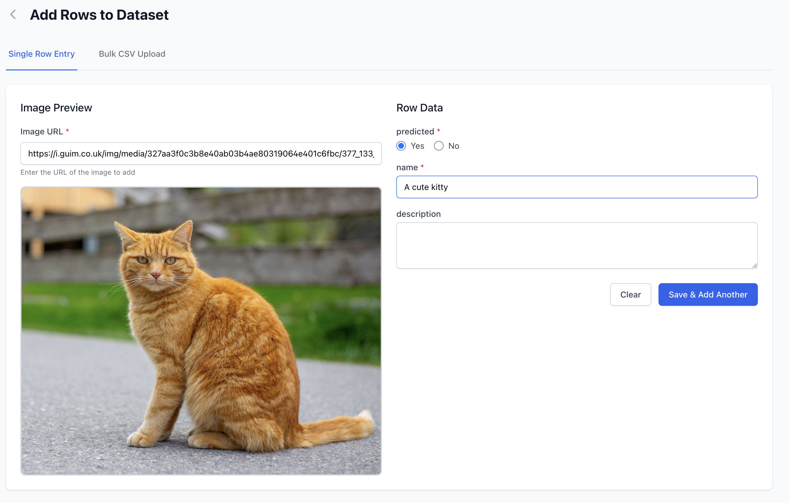
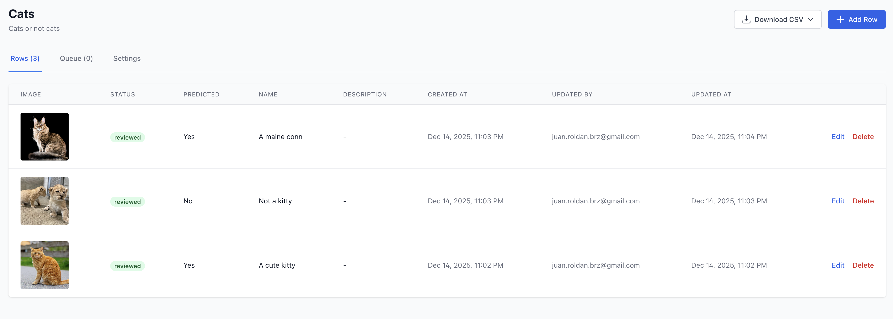
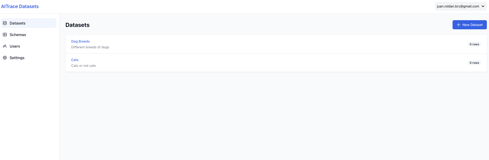
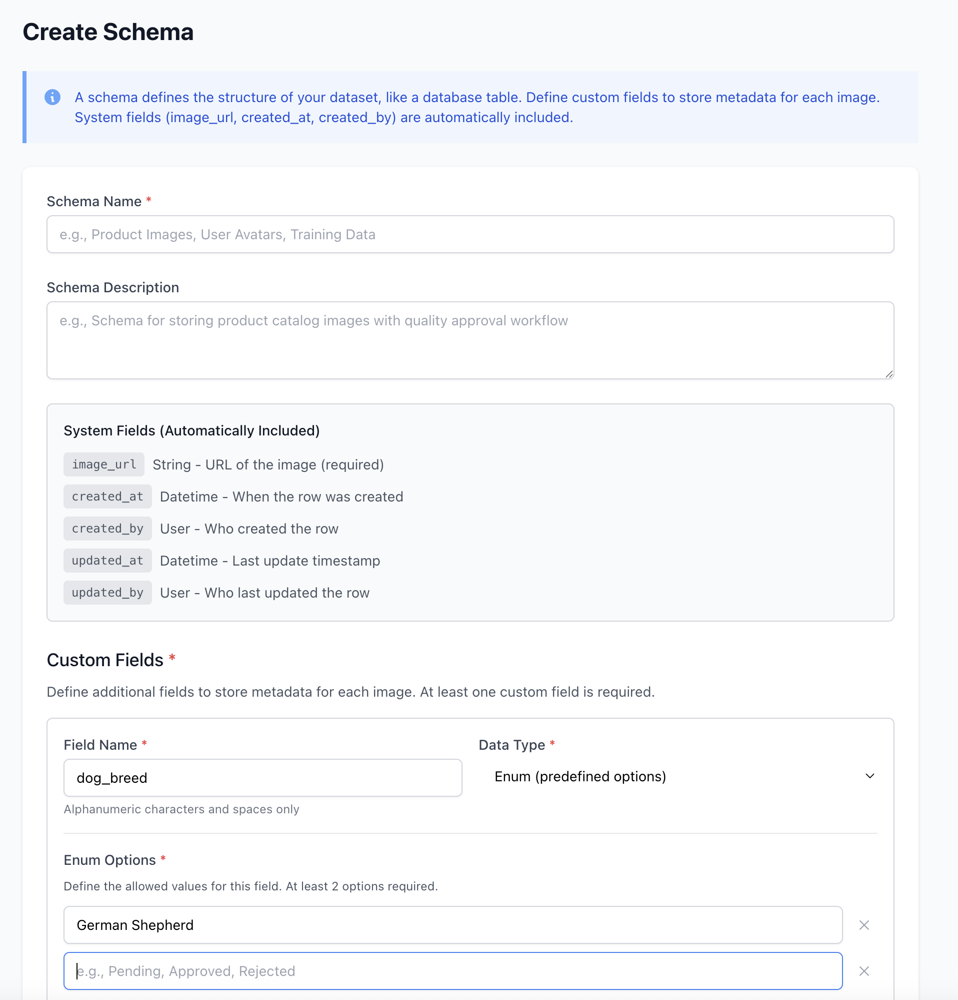

# AITrace Datasets

> A modern, open-source dataset management tool for AI/ML teams building vision models. Organize, label, and review image datasets with an intuitive Airtable-inspired interface.


---

## 📸 Screenshots

### Datasets Overview
Manage all your image datasets in one place with pagination and statistics.



### Dataset Detail View
View and manage all rows with images, custom fields, and status tracking.



### Review Queue
Navigate through pending images with an intuitive review interface.



### Schema Builder
Create custom schemas with flexible field types (boolean, text, numeric, enum).



---

## 🎯 What is AITrace Datasets?

AITrace Datasets is a self-hosted platform designed for managing image datasets used in AI/ML projects. Think of it as **Airtable meets Label Studio** - you get the flexibility of custom schemas with the power of image annotation workflows.

### Who is this for?

- **AI/ML Teams** building computer vision models who need to organize training data
- **Data Labeling Teams** who want a self-hosted, customizable annotation tool
- **Research Teams** managing datasets across multiple projects
- **Anyone** tired of managing image datasets in spreadsheets or cloud tools they don't control

### Why AITrace Datasets?

✅ **Self-hosted** - Your data stays on your infrastructure
✅ **Flexible Schemas** - Define custom fields for your specific use case
✅ **Review Workflows** - Built-in queue system for data validation
✅ **Bulk Operations** - CSV import/export for efficient data management
✅ **Team Collaboration** - Role-based access control (admin/user)
✅ **100% Open Source** - MIT licensed, no vendor lock-in

---

## ✨ Key Features

### 📋 Custom Schemas
Define your own data structure with multiple field types:
- **Boolean**: Yes/No flags (e.g., "contains person", "is valid")
- **Text**: Short or long text fields (e.g., descriptions, captions)
- **Numeric**: Integer or decimal numbers (e.g., object count, confidence score)
- **Enum**: Dropdown selections (e.g., category, quality rating)

### 🖼️ Image Dataset Management
- Add images via URL with one-click preview
- View images in full-screen modal
- Organize images with your custom metadata
- Track pending vs reviewed status for each row

### 🔄 Review Queue System
Navigate through pending images with keyboard-friendly controls:
- **Approve & Next** - Mark as reviewed and move forward
- **Skip** - Keep as pending and continue
- **Delete & Next** - Remove bad data instantly
- Real-time progress tracking with visual progress bar

### 📊 Bulk Operations
- **CSV Import**: Upload hundreds of rows at once with flexible column mapping
- **CSV Export**: Download reviewed or all rows for model training
- **Bulk Status Update**: Change multiple rows from pending to reviewed
- **Bulk Delete**: Clean up invalid data efficiently

### 👥 Team Collaboration
- **Admin Users**: Full control over datasets, schemas, and team members
- **Regular Users**: Can view and edit assigned datasets
- **Secure Authentication**: JWT-based auth with password hashing
- **Team Isolation**: Each team's data is completely separated

### 🎨 Clean, Modern UI
- Airtable-inspired table views with pagination
- Blue color scheme with intuitive navigation
- Responsive design that works on desktop and tablet
- Fast, reactive interface built with Vue 3

---

## 🚀 Quick Start

### Prerequisites

- **Docker & Docker Compose** (recommended) OR
- **Python 3.11+** and **PostgreSQL** (manual setup)
- **Node.js 20+** (only for local frontend development)

### Option 1: One-Command Docker Setup (Easiest!)

Just run this command and everything will be built and started:

```bash
# Clone the repository
git clone https://github.com/yourusername/aitrace-datasets.git
cd aitrace-datasets

# Start everything - builds app, starts database + application
docker-compose up

# Or run in background
docker-compose up -d

# Check logs
docker-compose logs -f app
```

**That's it!** Open http://localhost:8000 in your browser.

The first run will take a few minutes as it builds the Docker image (compiles frontend + backend). Subsequent starts are much faster.

> ⚠️ **Note**: This uses an insecure default SECRET_KEY suitable for local testing only. For production, see Option 2 below.

### Option 2: Production Docker Setup

Use this for production deployments with a secure secret key:

```bash
# Generate a secure secret key
export SECRET_KEY=$(openssl rand -hex 32)

# Start with production configuration
docker-compose -f docker-compose.prod.yml up -d

# Check logs
docker-compose -f docker-compose.prod.yml logs -f app
```

Access at http://localhost:8000

### Option 3: Local Development Setup (Hot Reload)

Use this if you want to develop the application with instant hot reload for frontend changes:

```bash
# 1. Start only the database
docker-compose up -d postgres

# 2. Install backend dependencies (requires uv: pip install uv)
uv sync

# 3. Create environment file
cp .env.example .env

# Edit .env and make sure ENV=local (important!)
nano .env

# 4. Start backend (http://localhost:8000)
uv run python src/aitrace/run_local.py

# 5. In a new terminal, start frontend (http://localhost:3000)
cd frontend
npm install
npm run dev
```

Now open http://localhost:3000 in your browser. Changes to frontend code will hot-reload automatically.

---

## 🔧 Environment Modes Explained

AITrace Datasets runs in two different modes depending on the `ENV` variable:

### Production Mode (ENV != "local")

**How it works:**
- Frontend is built into static files during Docker build
- Static files are embedded in the backend at `/src/aitrace/static/`
- FastAPI serves both API (`/api/*`) and frontend (all other routes)
- Single application running on one port

**When to use:**
- Production deployments
- Staging environments
- Single-container deployments
- When you want a simple, all-in-one package

**Access:**
- Application: http://localhost:8000
- API Docs: http://localhost:8000/api/docs

### Local Development Mode (ENV = "local")

**How it works:**
- Backend runs standalone with CORS enabled
- Frontend runs on separate dev server with hot reload
- Frontend proxies API requests to backend
- Two processes running on different ports

**When to use:**
- Local development
- Frontend changes with instant hot reload
- Backend development without rebuilding frontend
- Testing and debugging

**Access:**
- Frontend: http://localhost:3000 (with hot reload)
- Backend API: http://localhost:8000
- API Docs: http://localhost:8000/api/docs

### Configuration

```bash
# .env file

# For local development (separate frontend/backend)
ENV=local

# For production (embedded frontend)
ENV=production
# or simply don't set ENV (defaults to production)
```

---

## 📖 First-Time Setup

After starting the application for the first time:

1. **Navigate to Setup Page**
   - Go to http://localhost:8000/setup (or :3000 in dev mode)
   - You'll be automatically redirected if setup is needed

2. **Create Admin Account**
   - Enter your email (e.g., admin@yourcompany.com)
   - Create a strong password (min 8 characters)
   - A default team is created automatically

3. **Login**
   - Use your credentials to login
   - You'll be directed to the Datasets page

4. **Create Your First Schema**
   - Go to Schemas → New Schema
   - Define your fields (e.g., "contains_person: boolean", "description: text")
   - Save the schema

5. **Create Your First Dataset**
   - Go to Datasets → New Dataset
   - Select your schema
   - Add a name and description

6. **Add Images**
   - Open your dataset
   - Click "Add Row"
   - Paste image URL and fill in your custom fields
   - Or use "Bulk CSV Upload" for multiple images

7. **Review Your Data**
   - Switch to the "Queue" tab
   - Review pending images one by one
   - Approve, skip, or delete as needed

---

## 🏗️ Architecture & Tech Stack

### Backend
- **FastAPI** - High-performance async Python web framework
- **PostgreSQL** - Robust relational database
- **SQLAlchemy 2.0** - Async ORM with type hints
- **Pydantic v2** - Data validation and settings management
- **JWT** - Secure token-based authentication
- **Asyncpg** - Fast async PostgreSQL driver

### Frontend
- **Vue 3** - Progressive JavaScript framework with Composition API
- **Vite** - Lightning-fast build tool
- **Pinia** - Intuitive state management
- **Tailwind CSS** - Utility-first CSS framework
- **TypeScript** - Type-safe JavaScript
- **Vue Router** - Client-side routing

### Deployment
- **Docker** - Containerized application
- **Multi-stage build** - Optimized production images
- **Static file serving** - Frontend embedded in backend

---

## 📁 Project Structure

```
aitrace-datasets/
├── src/aitrace/              # Backend Python application
│   ├── common/               # Shared utilities (settings, database, exceptions)
│   ├── models/               # SQLAlchemy models & Pydantic schemas
│   ├── repositories/         # Data access layer (database queries)
│   ├── services/             # Business logic
│   ├── routes/               # API endpoints (FastAPI routers)
│   ├── main.py               # FastAPI app initialization
│   ├── run_local.py          # Local development runner
│   └── static/               # Frontend build output (production only)
│
├── frontend/                 # Vue 3 frontend application
│   ├── src/
│   │   ├── components/       # Reusable Vue components
│   │   ├── pages/            # Page components
│   │   ├── stores/           # Pinia state management
│   │   ├── services/         # API client services
│   │   ├── router/           # Vue Router configuration
│   │   └── types/            # TypeScript type definitions
│   ├── package.json
│   └── vite.config.ts
│
├── database/
│   └── schema.sql            # PostgreSQL database schema
│
├── deployment/               # Production deployment scripts
│   ├── scripts/
│   │   ├── deploy.sh         # Cloud Run deployment
│   │   └── setup_infra.sh    # Infrastructure setup
│   └── env-vars.yaml         # Environment configuration
│
├── tests/                    # Backend tests
├── Dockerfile                # Production Docker image
├── docker-compose.yml        # Local development
├── docker-compose.prod.yml   # Production deployment
├── pyproject.toml            # Python dependencies
└── .env.example              # Environment variables template
```

---

## 🔒 Environment Variables

| Variable | Required | Default | Description |
|----------|----------|---------|-------------|
| `ENV` | No | `production` | Set to `local` for development (enables CORS, disables static serving) |
| `POSTGRES_CONNECTION_MODE` | No | `direct` | Connection mode: `direct` or `cloud_sql` |
| `POSTGRES_HOST` | Yes | - | PostgreSQL host (e.g., `localhost`, `postgres`) |
| `POSTGRES_PORT` | No | `5432` | PostgreSQL port |
| `POSTGRES_USER` | Yes | - | PostgreSQL username |
| `POSTGRES_PASSWORD` | Yes | - | PostgreSQL password |
| `POSTGRES_DB` | Yes | - | PostgreSQL database name |
| `SECRET_KEY` | Yes | - | JWT signing key (min 32 characters, use `openssl rand -hex 32`) |
| `LOG_LEVEL` | No | `INFO` | Logging verbosity (`DEBUG`, `INFO`, `WARNING`, `ERROR`) |

### Example `.env` file

```bash
# Local Development
ENV=local

# Database
POSTGRES_CONNECTION_MODE=direct
POSTGRES_HOST=localhost
POSTGRES_PORT=5432
POSTGRES_USER=postgres
POSTGRES_PASSWORD=postgres
POSTGRES_DB=aitrace

# Security
SECRET_KEY=your-super-secret-key-at-least-32-characters-long-generated-with-openssl

# Logging
LOG_LEVEL=DEBUG

# Production (don't set ENV or set to 'production')
# ENV=production
# POSTGRES_HOST=your-db-host
# POSTGRES_USER=produser
# POSTGRES_PASSWORD=<secure-password>
# POSTGRES_DB=aitrace
# SECRET_KEY=<your-production-secret>
# LOG_LEVEL=INFO
```

---

## 🐳 Deployment Options

### Option 1: Docker Compose (Recommended for most users)

```bash
# Production with embedded frontend
docker-compose -f docker-compose.prod.yml up -d

# Access at http://localhost:8000
```

### Option 2: Single Docker Container

```bash
# Build the image
docker build -t aitrace-datasets .

# Run with your database
docker run -d \
  -p 8000:8000 \
  -e POSTGRES_HOST=your-db-host \
  -e POSTGRES_USER=postgres \
  -e POSTGRES_PASSWORD=yourpassword \
  -e POSTGRES_DB=aitrace \
  -e SECRET_KEY=$(openssl rand -hex 32) \
  aitrace-datasets
```

### Option 3: Google Cloud Run

See [deployment/README.md](deployment/README.md) for complete Cloud Run deployment guide.

```bash
# Quick deploy
cd deployment/scripts
./deploy.sh
```

### Option 4: Manual Python Setup

```bash
# Install dependencies
uv sync

# Set environment variables
export ENV=production
export POSTGRES_HOST=your-db-host
export POSTGRES_USER=postgres
export POSTGRES_PASSWORD=yourpassword
export POSTGRES_DB=aitrace
export SECRET_KEY=$(openssl rand -hex 32)

# Build frontend
cd frontend
npm install
npm run build
cd ..

# Copy frontend build to backend static folder
mkdir -p src/aitrace/static
cp -r frontend/dist/* src/aitrace/static/

# Run with uvicorn
uvicorn aitrace.main:app --host 0.0.0.0 --port 8000
```

---

## 🛠️ Development

### Backend Development

```bash
# Install dependencies
uv sync

# Start backend (with auto-reload)
uv run python src/aitrace/run_local.py

# Run tests
uv run pytest

# Format code
uv run black src/ tests/
uv run isort src/ tests/

# Type checking
uv run mypy src/
```

### Frontend Development

```bash
cd frontend

# Install dependencies
npm install

# Start dev server (hot reload)
npm run dev

# Build for production
npm run build

# Preview production build
npm run preview

# Lint and format
npm run lint
```

### Database Migrations

Currently using raw SQL schema. For changes:

1. Edit `database/schema.sql`
2. Drop and recreate database (development only!)
3. Production: Write manual migration SQL

Future: Will add Alembic for proper migrations.

---

## 📚 API Documentation

When running, visit http://localhost:8000/api/docs for interactive API documentation (Swagger UI).

### Key Endpoints

**Authentication**
- `POST /api/v1/auth/login` - Login with email/password
- `GET /api/v1/auth/me` - Get current user info
- `PUT /api/v1/auth/password` - Change password

**Schemas**
- `GET /api/v1/schemas` - List all schemas
- `POST /api/v1/schemas` - Create new schema
- `PUT /api/v1/schemas/{id}` - Update schema
- `DELETE /api/v1/schemas/{id}` - Delete schema

**Datasets**
- `GET /api/v1/datasets` - List datasets (paginated)
- `POST /api/v1/datasets` - Create dataset
- `GET /api/v1/datasets/{id}` - Get dataset details
- `PUT /api/v1/datasets/{id}` - Update dataset
- `DELETE /api/v1/datasets/{id}` - Delete dataset

**Rows (Images + Data)**
- `GET /api/v1/datasets/{id}/rows` - List rows (with filters)
- `GET /api/v1/datasets/{id}/rows/queue` - Get review queue
- `POST /api/v1/datasets/{id}/rows` - Add single row
- `PUT /api/v1/datasets/{id}/rows/{rowId}` - Update row
- `DELETE /api/v1/datasets/{id}/rows/{rowId}` - Delete row
- `POST /api/v1/datasets/{id}/rows/import` - CSV bulk import
- `GET /api/v1/datasets/{id}/rows/export` - CSV export

---

## 🤝 Contributing

We love contributions! Whether it's bug reports, feature requests, or code contributions.

### How to Contribute

1. **Fork the repository**
2. **Create a feature branch** (`git checkout -b feature/amazing-feature`)
3. **Make your changes**
4. **Run tests** (`uv run pytest`)
5. **Commit your changes** (`git commit -m 'Add amazing feature'`)
6. **Push to your fork** (`git push origin feature/amazing-feature`)
7. **Open a Pull Request**

See [CONTRIBUTING.md](CONTRIBUTING.md) for detailed guidelines.

### Development Guidelines

- Follow existing code style (Black for Python, Prettier for TypeScript)
- Add tests for new features
- Update documentation
- Keep commits focused and atomic
- Write clear commit messages

---

## 🗺️ Roadmap

### Planned Features

#### 🤖 AI-Powered Features
- [ ] **AI Dataset Creation** - Describe your dataset needs in natural language and automatically fetch images from Google Images API
- [ ] **Auto-labeling Agent** - Train custom AI agents to automatically label images based on your schema and existing labeled data
- [ ] **Smart Suggestions** - AI-powered field suggestions while labeling
- [ ] **Similarity Search** - Find similar images in your dataset using embeddings

#### 🚀 Core Features
- [ ] **Multi-team support** - Multiple isolated teams in one instance
- [ ] **User invitations** - Email invites with team quotas
- [ ] **Email verification** - Verify user emails on signup
- [ ] **2FA authentication** - TOTP-based two-factor auth
- [ ] **Social login** - Google, GitHub OAuth

#### 📦 Data Management
- [ ] **Image proxy/caching** - Cache external images locally
- [ ] **Advanced export formats** - JSON, Parquet, COCO format
- [ ] **Advanced search** - Full-text search, filters, saved queries

#### 🔧 Developer Experience
- [ ] **API keys** - Programmatic access without passwords
- [ ] **Webhooks** - Real-time notifications for events
- [ ] **Keyboard shortcuts** - Navigate review queue with keyboard
- [ ] **Mobile app** - React Native mobile companion

### Completed Features

- [x] Custom schema builder
- [x] Dataset management
- [x] Review queue with keyboard navigation
- [x] CSV import/export
- [x] Bulk operations
- [x] Team collaboration
- [x] Role-based access control
- [x] Docker deployment
- [x] Full-screen image viewer

---

## 📝 License

This project is fully open source and licensed under the **MIT License**.

See [LICENSE](LICENSE) for details.

**What this means:**
- ✅ Use commercially
- ✅ Modify the code
- ✅ Distribute
- ✅ Use privately
- ✅ No warranty provided

---

## 💬 Support & Community

### Getting Help

- **Documentation**: You're reading it! Check other docs in `implementation/` folder
- **GitHub Issues**: [Report bugs or request features](https://github.com/yourusername/aitrace-datasets/issues)
- **GitHub Discussions**: [Ask questions and share ideas](https://github.com/yourusername/aitrace-datasets/discussions)

### FAQ

**Q: Can I use this for commercial projects?**
A: Yes! MIT license allows commercial use.

**Q: Is my data secure?**
A: Yes, it's self-hosted on your infrastructure. Data never leaves your servers.

**Q: Can I customize the UI?**
A: Absolutely! Fork the repo and modify as needed. It's open source.

**Q: What image formats are supported?**
A: Any format your browser can display (JPEG, PNG, GIF, WebP). Images are loaded via URL.

**Q: How do I backup my data?**
A: Use `pg_dump` on your PostgreSQL database. Images are stored as URLs (not files).

```bash
# Backup database
docker exec -i $(docker-compose ps -q postgres) pg_dump -U postgres aitrace > backup.sql

# Restore database
docker exec -i $(docker-compose ps -q postgres) psql -U postgres -d aitrace < backup.sql
```

**Q: Can I host this on Heroku/Railway/Render?**
A: Yes! Any platform that supports Docker will work.

---

## 🙏 Acknowledgments

Built with love by [Bluggie SG PTE LTD](https://bluggie.com)

Special thanks to the open source community and all contributors!

### Built With

- [FastAPI](https://fastapi.tiangolo.com/) - Modern Python web framework
- [Vue.js](https://vuejs.org/) - Progressive JavaScript framework
- [PostgreSQL](https://www.postgresql.org/) - Powerful open source database
- [Tailwind CSS](https://tailwindcss.com/) - Utility-first CSS framework
- [Vite](https://vitejs.dev/) - Next generation frontend tooling

---

**⭐ Star us on GitHub if you find this useful!**
